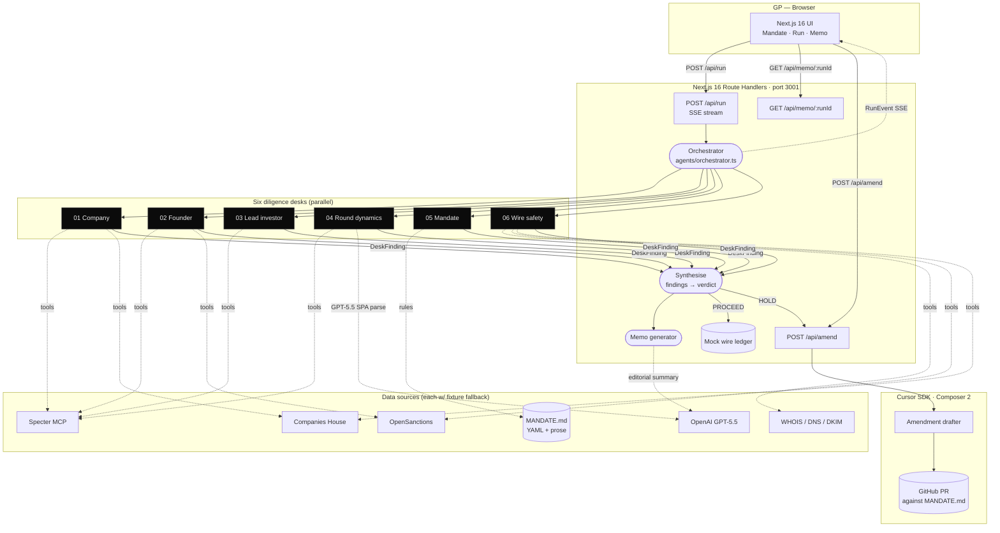
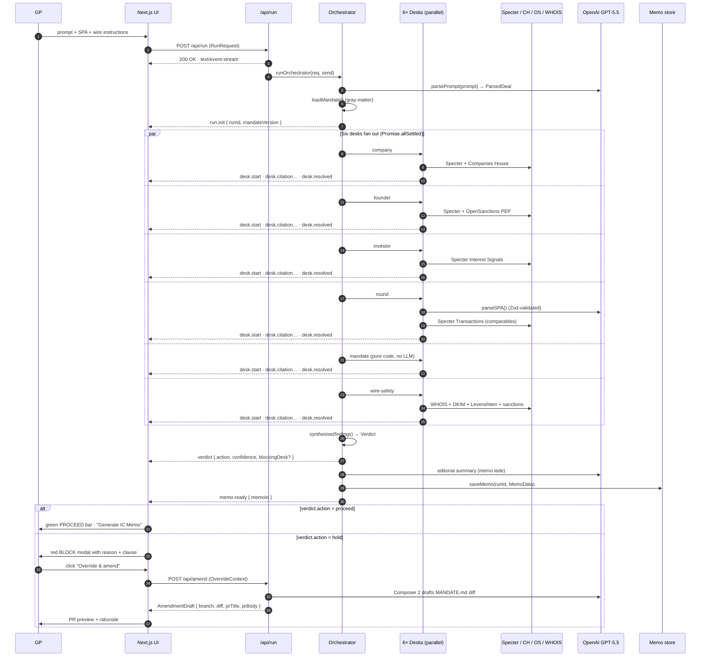
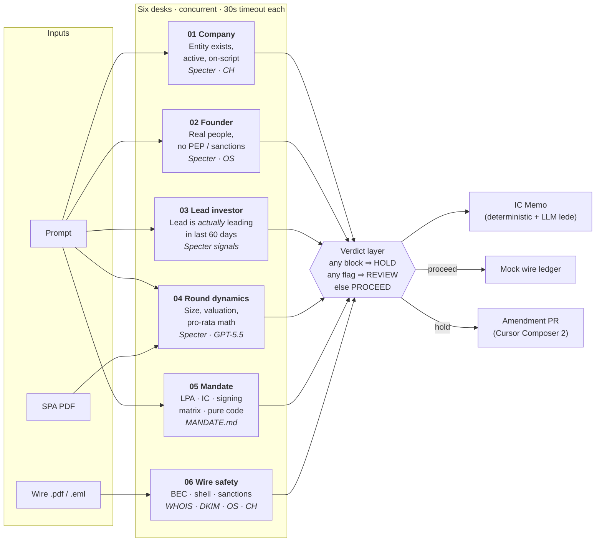
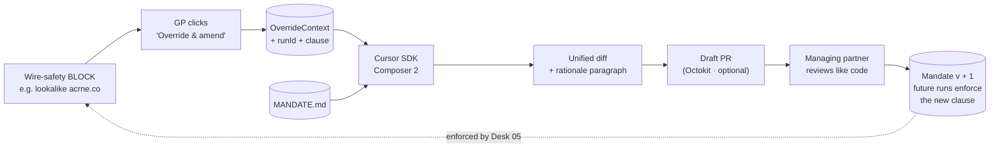

<div align="center">

# UnderWriter

### Autonomous VC Diligence, in 60 Seconds

*A Cursor-driven agent that fans out six diligence desks, streams findings to a Next.js UI in real time, synthesises an IC-grade verdict, and queues a wire — or holds it and proposes a mandate amendment as a pull request.*

[](https://cursor.com)
[](https://nextjs.org)
[](https://react.dev)
[](https://www.typescriptlang.org)
[](https://openai.com)
[](https://tryspecter.com)

</div>

---

## The pitch in one paragraph

A GP types: *"Wire $2M to Acme Robotics for their Series A. Lead is Sequoia. 50% pro-rata of our $4M allocation."*
UnderWriter parses the prompt and SPA, fans **six concurrent diligence desks** out across Specter, Companies House, OpenSanctions, WHOIS and the fund's own `MANDATE.md`, streams every citation to the UI as it lands, and either **queues the wire** or **fires a BLOCK** — catching, for example, a one-letter typo (`acrne.co` vs `acme.co`) on a forged wire-instruction email registered six days ago with a failing DKIM signature. When the verdict is HOLD, a Cursor SDK Composer-2 agent drafts a pull request that amends the mandate so the same pattern can never slip through again. **The fund's playbook compounds in git.**

> **The demo catches a $2M Business Email Compromise in 60 seconds** that a junior associate would have wired.

The Specter integration follows [`backend/docs/SPECTER_FLOW.md`](./backend/docs/SPECTER_FLOW.md) end-to-end — `POST /companies` → `GET /companies/{id}/people` → `GET /people/{id}` → `GET /companies/{id}/similar`, the §3b derived fields (`prior_exits`, `stealth_history`, `departed_subject_company`), and the §4 cross-step underwriting flags (`founder_departed_before_close`, `ex_founder_now_at_investor`, `funding_outlier_high|low`). The canonical worked example — Dex (`meetdex.ai`) closing a $5.3M Seed led by a16z with a co-founder who exited 26 days before close and now scouts for the lead — ships as a third demo seed (`dex-meetdex`).

---

## Why this matters

| Problem | UnderWriter's answer |
| --- | --- |
| BEC scams cost the industry **$2.7B/year** ([FBI IC3 2023](https://www.ic3.gov/AnnualReport/Reports/2023_IC3Report.pdf)) | A dedicated **Wire Safety desk** runs WHOIS + Levenshtein + DKIM + sanctions screening on every wire |
| Diligence is a 2-week analyst slog of 30 browser tabs | **Six desks in parallel**, joined at a single verdict, in under 30 seconds |
| Every fund has a mandate; nobody reads it | The mandate **is the agent's source code** — pure rule evaluation, deterministic, auditable |
| Policy drifts; institutional knowledge evaporates | Every override drafts a **PR against `MANDATE.md`** with rationale and run reference |

---

## Technology stack

<table>
  <thead>
    <tr><th>Layer</th><th>Technology</th><th>Why</th></tr>
  </thead>
  <tbody>
    <tr><td rowspan="3"><b>Agent runtime</b></td><td>Cursor SDK · Composer 2</td><td>Sandboxed cloud VMs, parallel subagents, MCP tooling, file-editing for amendment PRs</td></tr>
    <tr><td>OpenAI GPT-5.5</td><td>Structured prompt parsing, SPA/wire extraction, memo editorial summary (Zod-validated)</td></tr>
    <tr><td>MCP (Model Context Protocol)</td><td>Specter, Companies House, OpenSanctions, WHOIS exposed as tools</td></tr>
    <tr><td rowspan="3"><b>Backend</b></td><td>Next.js 16 Route Handlers</td><td>Single runtime for HTTP + SSE; zero ops surface area</td></tr>
    <tr><td>React 19 · TypeScript 5</td><td>End-to-end type safety from <code>RunEvent</code> at the seam</td></tr>
    <tr><td>Server-Sent Events (SSE)</td><td>Live streaming of <code>desk.start</code> / <code>desk.citation</code> / <code>desk.resolved</code> / <code>verdict</code></td></tr>
    <tr><td rowspan="3"><b>Data sources</b></td><td>Specter (companies, people, transactions, interest signals)</td><td>The unique data — who's <i>actually</i> leading the round in the last 60 days</td></tr>
    <tr><td>Companies House · OpenSanctions · WHOIS</td><td>Registry truth, sanctions/PEP screening, domain provenance</td></tr>
    <tr><td>PDF / EML parsing (<code>pdf-parse</code>, <code>mailauth</code>)</td><td>SPA extraction; SPF / DKIM / DMARC verification on inbound wire emails</td></tr>
    <tr><td rowspan="2"><b>Frontend</b></td><td>Next.js 16 App Router · React 19</td><td>Mandate / Run / Memo screens; SSE consumer renders tiles in real time</td></tr>
    <tr><td>CSS variables + dark/light theme</td><td>Fixed-width memo template that looks like a real fund document</td></tr>
    <tr><td><b>Validation</b></td><td>Zod</td><td>Every LLM output is schema-checked before it touches the verdict layer</td></tr>
    <tr><td><b>Mandate</b></td><td><code>gray-matter</code> (YAML frontmatter) + Markdown</td><td>The policy file <i>is</i> the source of truth — readable by LPs, executable by the agent</td></tr>
    <tr><td><b>Resilience</b></td><td>In-memory cache + fixture fallback per source</td><td><code>DEMO_FORCE_FIXTURES=true</code> = on-stage panic button</td></tr>
    <tr><td><b>Mock rails</b></td><td>In-process wire ledger</td><td>No real money moves; every run is a queued / held entry</td></tr>
  </tbody>
</table>

---

## System architecture



---

## The diligence run, end to end



---

## The six desks at a glance



Each desk emits its own `desk.start` → `desk.citation*` → `desk.resolved` event sequence. The orchestrator never blocks on the slowest desk — `Promise.allSettled` plus a 30-second per-desk hard timeout guarantees the verdict layer always runs.

---

## The amendment loop — the agent edits the agent



> Every override is a learning event. The mandate becomes the fund's compounding moat — versioned, reviewed, merged.

---

## Quick start

The backend runs end-to-end against fixtures with **zero API keys** required.

```bash
# Backend (port 3001)
cd backend
npm install
npm run dev
```

In a second terminal — the smoke driver POSTs both seeded scenarios to `/api/run`, prints the streaming desk events, fetches the memo, and draws the amendment-PR draft for the BEC run:

```bash
cd backend
npm run smoke
```

Frontend (port 3000):

```bash
cd front-end
npm install
npm run dev
```

Then open <http://localhost:3000>.

---

## Backend API

All endpoints are versionless and consumed by the UI over HTTP.

| Method | Path | Description |
| ------ | ---- | ----------- |
| `GET`  | `/api/health`        | Liveness probe |
| `POST` | `/api/run`           | Start a diligence run; streams `RunEvent` lines as SSE (`text/event-stream`) |
| `GET`  | `/api/memo/{runId}`  | Returns `MemoData` for a completed run |
| `POST` | `/api/amend`         | Drafts an amendment PR from an `OverrideContext` |

The full SSE event schema lives in [`backend/lib/contract.ts`](./backend/lib/contract.ts) — a single source of truth shared by backend and UI.

<details>
<summary><b>Curl smoke (click to expand)</b></summary>

```bash
# Health
curl -s http://localhost:3001/api/health

# Streaming run — clean Acme (expected verdict: PROCEED, 6/6 desks pass)
curl -N -X POST http://localhost:3001/api/run \
  -H 'Content-Type: application/json' \
  -d '{
    "prompt": "Wire $2,000,000 to Acme Robotics for their Series A. Lead is Sequoia. 50% pro-rata of our $4,000,000 allocation.",
    "files": [
      {"name":"acme_spa.pdf","mime":"application/pdf","size":0,"ref":"spa"},
      {"name":"wire_instructions_clean.pdf","mime":"application/pdf","size":0,"ref":"wi-clean"}
    ],
    "fixtureSeed": "clean-acme"
  }'

# Streaming run — SPECTER_FLOW canonical Dex deal (expected verdict: REVIEW)
curl -N -X POST http://localhost:3001/api/run \
  -H 'Content-Type: application/json' \
  -d '{
    "prompt": "Wire $2,650,000 to Dex for their Seed. Lead is Andreessen Horowitz. 50% pro-rata of our $5,300,000 allocation.",
    "files": [
      {"name":"dex_spa.pdf","mime":"application/pdf","size":0,"ref":"spa"},
      {"name":"wire_instructions_clean.pdf","mime":"application/pdf","size":0,"ref":"wi-clean"}
    ],
    "fixtureSeed": "dex-meetdex"
  }'

# Memo for a completed run
curl -s http://localhost:3001/api/memo/<runId>

# Amend (draft a PR after a wire-safety BLOCK)
curl -s -X POST http://localhost:3001/api/amend \
  -H 'Content-Type: application/json' \
  -d '{
    "runId": "<runId>",
    "blockingDesk": "wire",
    "blockingReason": "Lookalike domain acrne.co vs verified acme.co — wire_safety §6.2",
    "clause": "wire_safety §6.2",
    "rationale": "Confirmed BEC pattern; tighten policy."
  }'
```

</details>

---

## Demo scenarios

The demo ships with two seeded buttons — one contrast, one story.

| Scenario | Verdict | What the audience sees |
| --- | --- | --- |
| 🟢 **Clean Acme deal** | `PROCEED` · 6/6 desks pass | Tiles light up green over ~30 s · IC memo renders · wire queues |
| 🔴 **BEC Acme deal** | `HOLD` · Wire desk BLOCK | Five tiles green; **Wire safety** lands red with: lookalike domain (`acrne.co` ↔ `acme.co`, edit distance 1), domain age 6 days, DKIM fail, beneficial-owner mismatch · BLOCK modal cites `wire_safety §6.2` · GP clicks **Override & amend** → Cursor Composer 2 drafts a `MANDATE.md` PR |
| 🟡 **Dex (`meetdex.ai`)** | `REVIEW` · Founder desk flag | Five tiles green; **Founder desk** turns yellow with two SPECTER_FLOW.md §4 flags surfaced: `founder_departed_before_close` (Harry Uglow exited 26 days before the Seed close) and `ex_founder_now_at_investor` (his current tagline references "a16z speedrun scout", a listed investor). Verdict is REVIEW — the data does not block the deal, but the AI underwriter has surfaced what a human reader might miss. |

Set `DEMO_FORCE_FIXTURES=true` to skip every live API and serve from `backend/fixtures/`. **The on-stage panic button.**

---

## Project layout

```
underwriter-cursorhack/
├── backend/                          # Next.js 16 Route Handlers (port 3001)
│   ├── app/api/
│   │   ├── run/route.ts              # POST · SSE stream of RunEvent
│   │   ├── memo/[runId]/route.ts     # GET · MemoData
│   │   ├── amend/route.ts            # POST · AmendmentDraft (Composer 2)
│   │   └── health/route.ts
│   ├── agents/
│   │   ├── orchestrator.ts           # fans out 6 desks, joins at verdict
│   │   ├── parse-prompt.ts           # GPT-5.5 → ParsedDeal (Zod)
│   │   ├── synthesise.ts             # findings → verdict (pure)
│   │   ├── memo.ts                   # findings + verdict → MemoData
│   │   ├── amend.ts                  # override → AmendmentDraft
│   │   └── desks/                    # company · founder · investor
│   │                                 # round · mandate · wire-safety
│   ├── lib/
│   │   ├── contract.ts               # ⭐ THE SEAM — shared types
│   │   ├── mandate-loader.ts         # gray-matter on MANDATE.md
│   │   ├── mandate-evaluator.ts      # pure rule evaluation (no LLM)
│   │   ├── ledger.ts                 # mock wire ledger
│   │   ├── cache.ts                  # in-memory + fixture fallback
│   │   └── sources/                  # specter (SPECTER_FLOW.md impl)
│   │                                 # companies-house · opensanctions
│   │                                 # whois · pdf-parse · llm
│   ├── fixtures/
│   │   └── specter/snapshots/        # canonical SpecterSnapshot fixtures
│   │                                 # (dex.json, acme.json)
│   ├── MANDATE.md                    # the policy file the agent runs against
│   └── docs/                         # Backend.md · ARCHITECTURE.md · DEMO.md
└── front-end/                        # Next.js 16 UI (port 3000)
    └── app/
        ├── components/               # MandateScreen · RunScreen · MemoScreen
        │                             # DeskTile · VerdictBar · BlockModal
        │                             # AmendmentPR · CreatePRModal
        └── state/                    # types · initial · fixtures
```

---

## Configuration

All external APIs are **optional** — the backend defaults to fixtures and runs cleanly with zero keys. See [`backend/.env.example`](./backend/.env.example) for the complete list (Cursor SDK, OpenAI, Specter, Companies House, OpenSanctions, WHOIS, GitHub).

```bash
DEMO_FORCE_FIXTURES=true   # bypass every live API — on-stage panic button
DEMO_GITHUB_REPO=          # if set, amendments open real PRs via Octokit
```

---

## Design principles

1. **The mandate is the spine.** Every decision is grounded in `MANDATE.md`. No agent has authority outside what the mandate grants. Overrides become amendments via PR.
2. **Six desks, parallel by default.** Each desk is a single-purpose subagent with one job, one data-source family, one output shape. They don't talk to each other — they join at the verdict step.
3. **Load-bearing data, not decorative.** Every desk has a primary source it cannot function without. If the source is down, the desk reports degraded confidence rather than fabricating.
4. **Calibrated escalation.** Desks don't say "looks fine." They say *PASS, confidence 0.94, basis: [Specter ID, Companies House filing, comparable round]*. The verdict layer treats confidence as input, not noise.
5. **The agent edits the agent.** Every override drafts an amendment PR. The fund's playbook compounds in git.
6. **Honest failure.** Three tiers (graceful degradation → desk-level flag → orchestrator error). Citations carry `cached: true` when fixtures fired. **We never fabricate a finding. We never silently omit a desk.**

---

## What this deliberately does *not* do

No real money movement (mock ledger only) · no email sending (drafts only) · no authentication (single-tenant demo) · no run persistence beyond process memory · no automatic retries (one shot, then fixture) · no PII logging.

---

## Credits

Built for the **Cursor Hackathon**. Thanks to:

- **[Cursor](https://cursor.com)** — the SDK, Composer 2, and the cloud sandboxes that make subagents real
- **[Specter](https://tryspecter.com)** — the load-bearing dataset for company, founder, investor, and round-dynamics desks
- **OpenAI · Companies House · OpenSanctions** — the rest of the data spine

---

<div align="center">
<sub><b>UnderWriter</b> — your fund's policy, executed.</sub>
</div>
