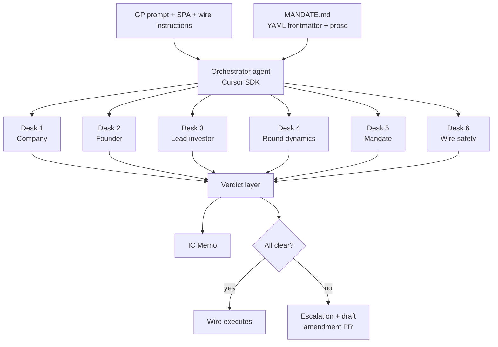
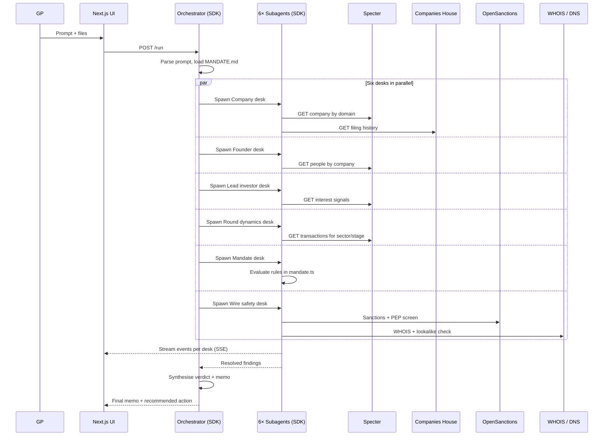

# Architecture

## Design principles

1. **The mandate is the spine.** Every decision is grounded in `MANDATE.md`. No agent has authority outside what the mandate grants. Overrides become amendments via PR.
2. **Six desks, parallel by default.** Each desk is a single-purpose subagent. They don't talk to each other. They join at the verdict step. This is fast, legible, and isolates failure.
3. **Load-bearing data, not decorative.** Each desk has a primary data source it cannot function without. If the data source is down, the desk reports degraded confidence rather than fabricating.
4. **Calibrated escalation.** A desk doesn't say "looks fine." It says "PASS, confidence 0.94, basis: [Specter ID, Companies House filing, comparable round]." The verdict layer treats confidence as input, not noise.
5. **The agent edits the agent.** Every override the GP makes generates a proposed amendment to `MANDATE.md`. The Cursor SDK opens it as a PR. The fund's playbook compounds in git.

---

## System overview



## The diligence run



---

## The six desks in detail

Each desk is an independent Cursor SDK agent with one job, one data source family, and one output shape: `{ status: 'pass'|'flag'|'block', confidence: 0..1, findings: [...], citations: [...] }`.

### 1. Company desk

**Job.** Verify the legal entity exists, is active, has a real footprint, and matches the prompt.

**Sources.** Specter Companies (revenue signals, headcount, news). Companies House / OpenCorporates (incorporation date, status, directors). The company's own website (HTTP fetch + favicon match).

**Block conditions.** Entity dissolved, in liquidation, or incorporated in the last 30 days with no Specter footprint. Name mismatch between Specter and registry.

### 2. Founder desk

**Job.** Confirm named founders exist, have the histories they claim, and have no disqualifying signals.

**Sources.** Specter People (employment history, education, prior companies, exits). LinkedIn cross-reference. OpenSanctions PEP screen on each founder.

**Block conditions.** Founder absent from Specter and LinkedIn. PEP/sanctions match. Pattern of dissolved companies in their history.

### 3. Lead investor desk

**Job.** Confirm the named lead is *actually* leading. This is the desk that's structurally impossible without Specter.

**Sources.** Specter Investors (Interest Signals — partner engagements, comparable rounds in the last 90 days, public posts). Specter Transactions (does this fund typically lead at this stage / sector?).

**Block conditions.** Zero Specter Interest Signals between the named lead and the company in the last 60 days. Stage / sector inconsistent with the named lead's pattern.

### 4. Round dynamics desk

**Job.** Sanity-check the round size, valuation, and pro-rata math against comparables.

**Sources.** Specter Transactions filtered by sector + stage + geography + 12-month window. SPA PDF parse for terms (LLM extraction).

**Outputs.** Median + IQR for round size and post-money. Whether the GP's pro-rata math reconciles to the SPA. Flags if the round is >2σ off the comparable median.

### 5. Mandate desk

**Job.** Evaluate the deal against every rule in `MANDATE.md`. This is pure code, no LLM in the hot path — deterministic and auditable.

**Sources.** `MANDATE.md` (parsed YAML frontmatter). Fund state (current portfolio, called capital, position by company) from a local fixture for the demo.

**Outputs.** Table of every rule, PASS / FAIL, with the binding clause cited. Hard-blocks on LPA breaches. Flags on IC charter softer rules.

### 6. Wire safety desk

**Job.** Catch BEC, shell-company impersonation, and sanctioned counterparties before money moves. **This is the desk that fires the BLOCK in the demo.**

**Sources.** OpenSanctions (OFAC, EU, UK HMT, PEPs). WHOIS (domain age). DNS (MX, SPF, DKIM). Levenshtein distance between wire-instruction sender domain and verified company domain. Beneficial owner from Companies House vs. account-holder name on wire instructions.

**Block conditions (the demo catches one of these):**
- Source domain edit-distance ≤ 2 from verified company domain → **BEC**.
- Source domain registered < 30 days → **BEC**.
- Account holder name mismatch with beneficial owner → **shell**.
- Sanctions or PEP hit on receiving entity / its directors → **screen**.

---

## Cursor SDK usage

This is the section that wins "Best use of Cursor." The SDK is doing four things no LLM-API wrapper could:

**Sandboxed cloud VMs per run.** Each diligence run gets a dedicated VM. The wire-safety desk fetches arbitrary domains, runs WHOIS, parses PDFs from external sources — sandboxed so a malicious SPA can't escape into our infra.

**Subagents in parallel.** The orchestrator fans out six subagents through the SDK's subagent primitive. Each gets its own context window, its own MCP tool set, and streams events independently. Total wall time is bounded by the slowest desk, not the sum.

**MCP for data sources.** Specter MCP is wired in directly. Companies House, OpenSanctions, and WHOIS are exposed as MCP tools to the desks that need them. The mandate desk gets *no* external tools by design — its job is pure rule evaluation.

**Self-modifying policy via PR.** When a GP overrides a verdict, the orchestrator spawns a Cursor SDK coding agent (Composer 2) that diffs the override against `MANDATE.md`, proposes a clause amendment, and opens a PR with the rationale. This is the loop that makes the fund's mandate compound.

```ts
// Sketch of the orchestration call
import { Agent } from '@cursor/sdk';

const orchestrator = await Agent.create({
  apiKey: process.env.CURSOR_API_KEY!,
  model: { id: 'composer-2' },
  cloud: { vm: 'sandboxed' },
  mcp: ['specter', 'companies-house', 'opensanctions', 'whois']
});

const desks = await Promise.all([
  orchestrator.subagent({ name: 'company',    skill: 'company-desk'    }),
  orchestrator.subagent({ name: 'founder',    skill: 'founder-desk'    }),
  orchestrator.subagent({ name: 'investor',   skill: 'investor-desk'   }),
  orchestrator.subagent({ name: 'round',      skill: 'round-desk'      }),
  orchestrator.subagent({ name: 'mandate',    skill: 'mandate-desk'    }),
  orchestrator.subagent({ name: 'wire',       skill: 'wire-safety-desk'})
]);

const findings = await Promise.all(
  desks.map(d => d.run({ deal, mandate, files }))
);

const verdict = synthesise(findings, mandate);
const memo    = renderMemo(deal, findings, verdict);

if (verdict.action === 'override') {
  await orchestrator.amendMandate({ override, rationale });
  // → opens a PR against MANDATE.md
}
```

---

## Failure modes & what we don't hide

A serious finance product is honest about edge cases. The judges will respect this.

- **Specter rate limits.** If the API is throttled mid-demo, desks fall back to cached fixtures for the seeded `Acme Robotics` deal. The UI shows `cached @ 14:02` rather than pretending. This is more credible than fabricating.
- **LLM hallucination on memo synthesis.** Every claim in the memo is tagged with its source desk and citation. If a desk didn't produce a finding, the memo doesn't claim it.
- **Adversarial SPA / wire PDF.** PDFs are parsed in the sandbox VM. Out-of-band payloads (embedded JS, malicious fonts) cannot reach the orchestrator.
- **Mandate gaps.** If a deal hits a dimension the mandate doesn't cover, the mandate desk returns `flag` not `pass` — better to escalate to a human than to silently approve.

---

## What's out of scope for the demo

- Real bank rails (we use a mock ledger or Modern Treasury sandbox).
- Multi-user auth, team management, settings.
- Persistent fund-state — for the demo, the fund's portfolio and called capital are in `fixtures/fund_state.json`.
- KYC on individual LPs (different problem domain).
- Email *sending*. Drafts only. The agent never autonomously contacts a third party in the live demo.
