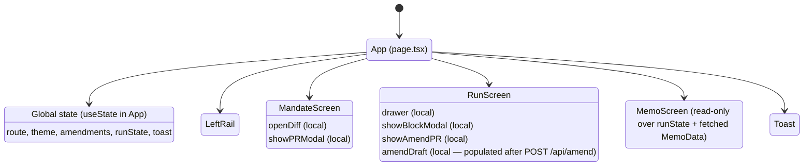
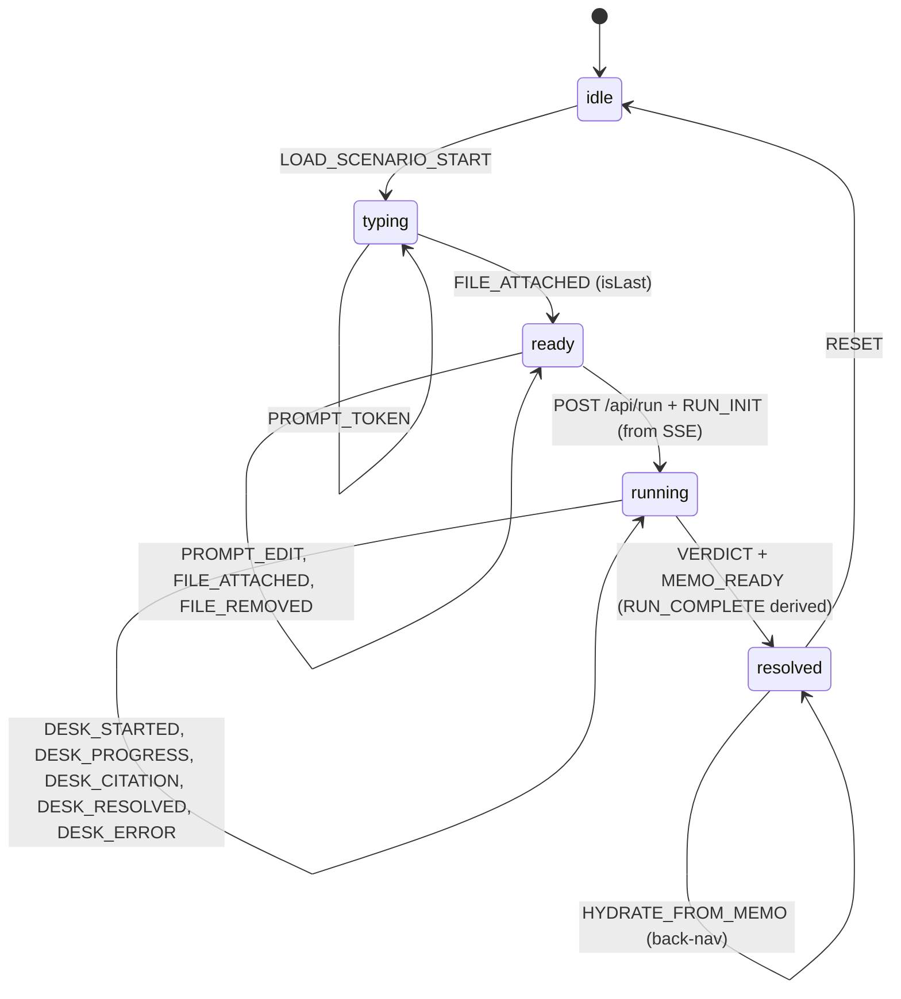
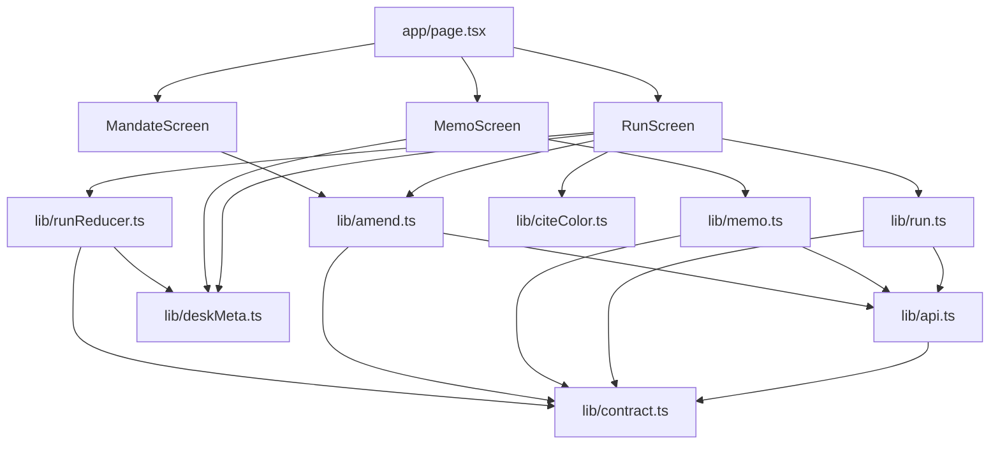

# Mandate Frontend — Ingestion Spec

> Planning doc. No implementation. Reader: an engineer about to wire
> the existing Next.js UI to the **TypeScript Next.js backend** that
> shipped as part of the `cursor/backend-restructure-0987` branch
> (commit `b776007`). The authoritative contract is
> [`backend/lib/contract.ts`](../backend/lib/contract.ts); the prose
> spec is [`backend/docs/Backend.md`](../backend/docs/Backend.md). This
> doc translates that contract into concrete frontend changes.

## 1. Overview

Mandate is a single-screen-rail Next.js 14 app with three routes:
*Mandate* (`MandateScreen`), *Diligence Run* (`RunScreen`), and *IC
Memo* (`MemoScreen`). It is the diligence cockpit for a single fund
(`acme-ventures-iii`); there are no users, no auth, no multi-tenant
concerns.

Today every byte of data is hard-coded in
`front-end/app/state/initial.ts` (the mandate document and amendment
log) and `front-end/app/state/fixtures.ts` (the run scenarios). The run
choreography — typewriter prompt, file pills, six desks streaming in
parallel, citations arriving, verdict bar settling — is driven entirely
by `setTimeout` chains inside `front-end/app/components/RunScreen.tsx`.

The backend the FE will now talk to is a separate Next.js app under
[`backend/`](../backend) (port `3001`, not Next.js front-end's `3000`).
It exposes four routes: `POST /api/run` (SSE), `GET /api/memo/[runId]`,
`POST /api/amend`, `GET /api/health`. There is **no database, no upload
endpoint, no `/api/mandate`, no `/api/amendments`**. The mandate is
parsed server-side from `backend/MANDATE.md`; runs and memos live in an
in-memory `Map<runId, …>` that resets on backend restart; files are
referenced by fixture id (`clean-acme` / `bec-acme`) — there's no blob
upload route yet.

After ingestion lands the frontend will:

- **Push** runs by `POST /api/run` with the prompt + file refs +
  optional `fixtureSeed`.
- **Stream** every run via SSE on the response body of that same call —
  there is no separate `events` URL; the POST response *is* the
  stream.
- **Pull** the IC memo via `GET /api/memo/[runId]` once the
  `memo.ready` event arrives.
- **Push** an amendment proposal via `POST /api/amend` after the GP
  clicks *Override and amend*; the response is an `AmendmentDraft`
  (diff + PR title/body, optional `prUrl`) that the FE prepends to its
  local amendment log.

The visual UI does not change much. Three real changes:

1. **Three-state verdict.** `proceed | review | hold` (was `proceed |
   hold`). The new `review` state needs a tile-yellow / verdict-bar
   amber treatment.
2. **`Desk` and `Cite` shapes change name.** The contract carries
   `DeskFinding` and `Citation`; the existing `Desk` / `Cite` types in
   `front-end/app/state/types.ts` must either be retyped to the
   contract or fed through an adapter at the SSE seam.
3. **No upload endpoint yet.** The Mandate-screen "New PR" file picker
   currently captures local `File` objects; with the new contract,
   uploaded files are *not* a thing — the run-screen demo presets
   reference fixture ids and the amendment flow doesn't carry
   attachments at all in v1. Document this regression in §15.

## 2. The contract (`backend/lib/contract.ts`)

This file is the single source of truth. Both halves of the team
import from it. Reproduced verbatim so this doc is grep-able:

```ts
// ----- Domain ------------------------------------------------------

export type DeskId =
  | "company" | "founder" | "investor" | "round" | "mandate" | "wire";

export type DeskNumber = "01" | "02" | "03" | "04" | "05" | "06";

export type Status = "idle" | "streaming" | "pass" | "flag" | "block";

export type SourceTag =
  | "specter" | "companies-house" | "opensanctions"
  | "whois"   | "mandate"         | "spa" | "linkedin";

export interface Citation {
  source: SourceTag;
  ref: string;            // ID, URL fragment, or short reference
  url?: string;
  detail?: string;        // human-readable context
  cached?: boolean;       // if served from fixture, label so on the UI
}

export interface DeskFinding {
  desk: DeskId;
  number: DeskNumber;
  title: string;          // tile header label, e.g. "COMPANY DESK"
  status: Exclude<Status, "idle" | "streaming">;
  confidence: number;     // 0..1
  durationMs: number;
  primary: string;        // tile headline finding (1 line)
  facts: string[];        // 2–4 supporting lines
  citations: Citation[];
  raw?: unknown;          // for the drawer's "show raw response" toggle
}

export interface Verdict {
  action: "proceed" | "review" | "hold";
  confidence: number;
  summary: string;
  blockingDesk?: DeskId;
  blockingReason?: string;
}

// ----- Run lifecycle ----------------------------------------------

export interface RunRequestFile {
  name: string;
  mime: string;
  size: number;
  /** Either a fixture id ("clean-acme") or an uploaded blob id. */
  ref: string;
}

export interface RunRequest {
  prompt: string;
  files: RunRequestFile[];
  fixtureSeed?: "clean-acme" | "bec-acme";
}

export interface RunInit {
  runId: string;
  startedAt: string;
  mandateVersion: number;
  fundId: string;
}

export type RunEvent =
  | { type: "run.init";      run: RunInit }
  | { type: "desk.start";    desk: DeskId }
  | { type: "desk.progress"; desk: DeskId; message: string }
  | { type: "desk.citation"; desk: DeskId; citation: Citation }
  | { type: "desk.resolved"; finding: DeskFinding }
  | { type: "verdict";       verdict: Verdict }
  | { type: "memo.ready";    memoId: string }
  | { type: "error";         desk?: DeskId; message: string };

// ----- Memo --------------------------------------------------------

export interface MemoData {
  runId: string;
  fund: { name: string; id: string };
  deal: {
    company: string;
    round: string;
    amountUsd: number;
    proRataPct?: number;
  };
  verdict: Verdict;
  findings: DeskFinding[];
  summary: string;             // 2-3 sentences, editorial
  recommendation: string;      // 1 sentence
  requiredActions: string[];   // ordered list
  generatedAt: string;
}

// ----- Amendment ---------------------------------------------------

export interface OverrideContext {
  runId: string;
  blockingDesk: DeskId;
  blockingReason: string;
  clause: string;              // e.g. "wire_safety §6.2"
  rationale?: string;          // free-text from GP
}

export interface AmendmentDraft {
  runId: string;
  branch: string;
  diff: string;                // unified diff against MANDATE.md
  prTitle: string;
  prBody: string;
  prUrl?: string;              // populated only if backend opened a real PR
}
```

The frontend should `import { … } from "@/lib/contract"` after copying
this file in (or symlinking, or publishing as a workspace package — see
§13). Do not redefine these types locally.

---

## 3. State model

### 3.1 Tree

Unchanged from the previous design — global state lives on `App`,
local UI affordances stay on each screen.



### 3.2 Global fields

| Field | Type | Reads | Writes | Persistence (now) | Persistence (proposed) |
|---|---|---|---|---|---|
| `route` | `Route` (`"mandate" \| "run" \| "memo"`) | `App`, `LeftRail` | `LeftRail`, screens via `go()` | in-memory | unchanged (URL-sync is out of scope) |
| `theme` | `Theme` (`"dark" \| "light"`) | `App` (mirror to `<html data-theme>`) | `LeftRail` toggle | in-memory + DOM attr | unchanged |
| `amendments` | `Amendment[]` (FE-local type) | `MandateScreen` (list, diff), `App` (`mandateVersion`, `nextAmendmentId`), `RunScreen` (`nextAmendmentId`) | `MandateScreen` (`CreatePRModal.onSubmit`), `RunScreen` (`AmendmentPR.onApprove`) | `INITIAL_AMENDMENTS` constant | **stays local** — backend doesn't expose `GET /api/amendments`. New entries are constructed from `AmendmentDraft` returned by `POST /api/amend` and prepended client-side. |
| `runState` | `RunState` | `RunScreen` (everything), `MemoScreen` (verdict / summary derivation) | `RunScreen` exclusively | `INITIAL_RUN_STATE` | hydrated by SSE events from `POST /api/run`; on hard refresh / back-nav, fetched via `GET /api/memo/[runId]` (since there is no `GET /api/runs/:id` snapshot — see §15) |
| `toast` | `string` | `Toast` | any screen via `setToast` | in-memory, auto-clears | unchanged |

### 3.3 Per-screen local state

| Screen | Local field | Type | Purpose |
|---|---|---|---|
| `MandateScreen` | `openDiff` | `number \| null` | which amendment id has its diff expanded |
| `MandateScreen` | `showPRModal` | `boolean` | shows `CreatePRModal` |
| `RunScreen` | `drawer` | `number \| null` | which desk index has `DeskDrawer` open |
| `RunScreen` | `showBlockModal` | `boolean` | shows BEC `BlockModal` |
| `RunScreen` | `showAmendPR` | `boolean` | shows `AmendmentPR` modal |
| `RunScreen` | `amendDraft` | `AmendmentDraft \| null` | populated when `POST /api/amend` returns; rendered into `AmendmentPR` |
| `CreatePRModal` | `summary, diffText, files, author, stage` | various | composed PR before submit (see §15 for upload regression) |
| `DeskDrawer` | `showRaw` | `boolean` | toggles raw-JSON pane (now backed by `DeskFinding.raw`) |

These stay local. The backend has nothing to say about them.

### 3.4 The shape mismatch the FE has to absorb

The current `front-end/app/state/types.ts` has its own `Desk` and
`Cite` types that pre-date the backend. They overlap with the new
`DeskFinding` and `Citation` but with different field names. Concretely:

| Old FE type (`types.ts`) | Contract type (`contract.ts`) | Note |
|---|---|---|
| `Desk.n` (`"01"–"06"`) | `DeskFinding.number` | renamed |
| `Desk.name` (e.g. `"Company Desk"`, title-case) | `DeskFinding.title` (e.g. `"COMPANY DESK"`, upper-case) | both renamed and re-cased; FE renders title verbatim, no extra transform |
| `Desk.icon` | *not on `DeskFinding`* | static lookup: keep `DESK_META: Record<DeskId, { icon: IconName }>` on FE |
| `Desk.primary` | `DeskFinding.primary` | identical |
| `Desk.facts` (single string with `·` separators) | `DeskFinding.facts: string[]` | FE either joins with `" · "` for the existing tile, or stops joining and renders as a list |
| `Desk.cites` | `DeskFinding.citations` | renamed; element shape also changes (see below) |
| `Desk.conf: string` (`"0.94"`) | `DeskFinding.confidence: number` | type change; FE formats with `(c).toFixed(2)` |
| `Desk.dur: string` (`"4.2s"`) | `DeskFinding.durationMs: number` | type change; FE formats as `(ms/1000).toFixed(1) + "s"` |
| `Desk.delay` | — | FE-only animation timing; gone from new world (real desks have real durations) |
| `Desk.status` | `DeskFinding.status` | identical literal set |

| Old `Cite` | Contract `Citation` | Note |
|---|---|---|
| `src: CiteSource` (`"specter"\|"ch"\|"sanctions"\|"whois"\|"mandate"\|"block"`) | `source: SourceTag` (`"specter"\|"companies-house"\|"opensanctions"\|"whois"\|"mandate"\|"spa"\|"linkedin"`) | renamed and value set differs; the cite-row CSS classes (`cite-row.specter`, `cite-row.ch`, etc) need a remap (see §13) |
| `text: string` | `ref: string` (often a short id) + `detail?: string` (human-readable) | the FE currently renders `text`; new pattern is `detail ?? ref` |
| `link?: boolean` | `url?: string` (actual URL) | nicer — FE renders an `<a>` instead of a flag-only icon |
| — | `cached?: boolean` | new — FE should append a small `cached @ HH:MM` chip to the cite when true |

**Recommended approach.** Replace the FE-local `Desk` and `Cite` in
`types.ts` with re-exports of `DeskFinding` and `Citation` from the
shared contract. Adapt the rendering code in `DeskTile.tsx`,
`DeskDrawer.tsx`, and `MemoScreen.tsx` to use the new field names.
Keep `runState.deskStates` as `Status[]` (still indexed 0–5 for grid
layout), but maintain a `findings: Record<DeskId, DeskFinding | null>`
map for the actual data — desks land into the map by `desk` id, the
grid renders them in the constant order `["company","founder",
"investor","round","mandate","wire"]`.

### 3.5 `runState` reducer — proposed action set

Today `runState` is a `useState` with ~10 inline `setRunState` callers
in `front-end/app/components/RunScreen.tsx`. Each is replaced by one
`dispatch`. The SSE consumer dispatches the matching action when an
event arrives. The typewriter and file-pill animations stay
client-side — they're prompt composition, not data ingestion.

| Action | Payload | Mutates | Triggered by |
|---|---|---|---|
| `LOAD_SCENARIO_START` | `{ scenario: "clean" \| "bec" }` | `mode → "typing"`, resets `prompt`, `files`, `findings`, `deskStates`, `citationsShown` | user clicks *Clean Acme deal* / *BEC Acme deal* |
| `PROMPT_TOKEN` | `{ text: string }` | `prompt = text` | typewriter tick (client) |
| `PROMPT_EDIT` | `{ text: string }` | `prompt = text` | user types in textarea |
| `FILE_ATTACHED` | `{ file: PromptFile, isLast: boolean }` | appends to `files`; if `isLast` then `mode → "ready"` | client-side staggered append after typewriter |
| `FILE_REMOVED` | `{ index: number }` | removes from `files` | user clicks `x` on file pill |
| `RUN_INIT` | `{ run: RunInit }` | `runId = run.runId`, `mode → "running"`, `runStart = Date.now()`, `deskStates` set to `"streaming"` for all six | SSE `run.init` |
| `DESK_STARTED` | `{ desk: DeskId }` | ensures `deskStates[idx(desk)] = "streaming"` (idempotent) | SSE `desk.start` |
| `DESK_PROGRESS` | `{ desk: DeskId, message: string }` | sets `progressMessages[desk] = message` (drives the spinner sub-text on the tile) | SSE `desk.progress` (optional) |
| `DESK_CITATION` | `{ desk: DeskId, citation: Citation }` | appends to `findings[desk].citations`; bumps a per-desk `citationsShown` counter | SSE `desk.citation` |
| `DESK_RESOLVED` | `{ finding: DeskFinding }` | `findings[finding.desk] = finding`; `deskStates[idx(desk)] = finding.status` (one of `pass\|flag\|block`) | SSE `desk.resolved` |
| `VERDICT` | `{ verdict: Verdict }` | `verdict = verdict`; if `action === "hold"` open `BlockModal` 600ms later | SSE `verdict` |
| `MEMO_READY` | `{ memoId: string }` | `memoId = memoId` (used by `RunScreen` to prefetch and by `MemoScreen` to fetch) | SSE `memo.ready` |
| `RUN_COMPLETE` | — | `mode → "resolved"` | derived: dispatched after `VERDICT` (the contract has no separate `run.complete` event — verdict + memo.ready bracket the end of the stream) |
| `DESK_ERROR` | `{ desk: DeskId, message: string }` | sets `findings[desk]` to a degraded `flag` finding (mirroring what the orchestrator does server-side) and stashes `message` for the drawer | SSE `error` with `desk` set |
| `RUN_ERROR` | `{ message: string }` | `mode → "resolved"` (terminal); shows toast | SSE `error` without `desk`, or fetch failure |
| `RESET` | — | `runState = INITIAL_RUN_STATE` | back-nav to a fresh run |
| `HYDRATE_FROM_MEMO` | `{ memo: MemoData }` | overlays the persisted run summary onto `runState` (used when entering the Memo route cold or after refresh) | `GET /api/memo/[runId]` |

> Note on `RUN_COMPLETE`. The contract does not emit a discrete
> "run-complete" frame — the stream simply closes after `memo.ready`.
> The reducer derives the transition: when the FE receives `verdict`
> *and* `memo.ready`, dispatch `RUN_COMPLETE`. Equivalently, listen for
> the `EventSource.close` / `ReadableStream` end and dispatch on that.

### 3.6 RunState — concrete shape

```ts
export interface RunState {
  // Composition (pre-run)
  mode: "idle" | "typing" | "ready" | "running" | "resolved";
  scenario: "clean-acme" | "bec-acme" | null;
  prompt: string;
  files: PromptFile[];

  // Run lifecycle
  runId: string | null;
  runStart: number | null;          // Date.now() when SSE opened

  // Desks — keyed by DeskId, indexed by the grid layout
  deskStates: Record<DeskId, Status>;          // initial: { company: "idle", … }
  findings:   Record<DeskId, DeskFinding | null>;
  progressMessages: Partial<Record<DeskId, string>>;
  citationsShown: Record<DeskId, number>;      // for animation accounting

  // Run outcome
  verdict: Verdict | null;
  memoId: string | null;

  // Errors
  errors: { desk?: DeskId; message: string }[];
}

export const DESK_ORDER: DeskId[] =
  ["company", "founder", "investor", "round", "mandate", "wire"];
export const DESK_META: Record<DeskId, { number: DeskNumber; icon: IconName; title: string }> = {
  company:  { number: "01", icon: "building",     title: "Company Desk" },
  founder:  { number: "02", icon: "user",         title: "Founder Desk" },
  investor: { number: "03", icon: "trending-up",  title: "Lead Investor Desk" },
  round:    { number: "04", icon: "bar-chart",    title: "Round Dynamics Desk" },
  mandate:  { number: "05", icon: "shield",       title: "Mandate Desk" },
  wire:     { number: "06", icon: "lock",         title: "Wire Safety Desk" },
};
```

`DESK_META` is FE-side only (the contract carries `number` and `title`
but not `icon`; icons are a UI concern). `title` here uses title-case
to match the existing FE styling — the contract's `DeskFinding.title`
is upper-case; render the FE's `DESK_META[desk].title` rather than
`finding.title` if you want to keep the existing title-case casing.

---

## 4. RunState state machine



| Transition | Trigger | Action(s) | Side effects |
|---|---|---|---|
| `idle → typing` | user clicks scenario button | `LOAD_SCENARIO_START` | client kicks off typewriter `setTimeout` chain; SSE not yet open |
| `typing → typing` | typewriter tick | `PROMPT_TOKEN` | none |
| `typing → ready` | last file pill appended | `FILE_ATTACHED { isLast: true }` | none — Run button enables |
| `ready → ready` | user edits | `PROMPT_EDIT` / `FILE_ATTACHED` / `FILE_REMOVED` | none in v1 — no upload endpoint |
| `ready → running` | user clicks Run | `POST /api/run`; on first SSE frame `RUN_INIT` | open `fetch` reader; start elapsed timer |
| `running → running` | each SSE frame | one of `DESK_STARTED` / `DESK_PROGRESS` / `DESK_CITATION` / `DESK_RESOLVED` / `DESK_ERROR` | per-tile animation flash on `DESK_RESOLVED` |
| `running → resolved` | `verdict` + `memo.ready` arrived | `VERDICT`, `MEMO_READY`, `RUN_COMPLETE` | open `BlockModal` 600ms later if `verdict.action === "hold"`; verdict bar tints by `action` |
| `resolved → idle` | user clicks scenario button again | `RESET` | clears `runId`, `verdict`, all desk maps |
| `resolved → resolved` | user navigates to Memo cold | `GET /api/memo/[runId]`, `HYDRATE_FROM_MEMO` | overlays summary fields onto runState |

---

## 5. Endpoint usage

The backend exposes four endpoints. All of them are consumed by the FE.

| Endpoint | Method | Caller in UI | Body | Response | Notes |
|---|---|---|---|---|---|
| `/api/health` | `GET` | `App` mount | — | `{ ok: true }` | Used as the "is backend up?" probe. On failure, render the *backend unreachable* overlay (see §10). |
| `/api/run` | `POST` | `RunScreen` *Run Diligence* button | `RunRequest` | **SSE stream** of `RunEvent` frames | The response *body itself* is the stream — no separate event URL. The client must read the body as a `ReadableStream`, not call `.json()`. |
| `/api/memo/[runId]` | `GET` | `MemoScreen` mount when `runState.memoId` is set; also `RunScreen` after `memo.ready` (prefetch) | — | `MemoData` (200) or `{ error, runId }` (404) | The FE uses this as the canonical memo source — every editorial string (summary, recommendation, requiredActions) comes from here, not from runtime derivation in the FE. |
| `/api/amend` | `POST` | `RunScreen` after the GP confirms in `BlockModal → AmendmentPR` | `OverrideContext` | `AmendmentDraft` | The returned `diff` is rendered in the existing `AmendmentPR` modal; on *Approve & merge*, the FE prepends a new local `Amendment` (constructed from the draft) onto its `amendments` array. |

The base URL is the backend's port (default `:3001`). Hard-code it in
the FE config / env (`NEXT_PUBLIC_BACKEND_URL`) and route through a
single `apiFetch()` wrapper.

### 5.1 `POST /api/run` request shape

```ts
const body: RunRequest = {
  prompt: state.prompt,
  files: state.files.map(f => ({
    name: f.name,
    mime: f.mime ?? "application/octet-stream",
    size: f.size ?? 0,
    ref: f.ref,    // see §9 — set to "clean-acme" / "bec-acme" or a fixture id
  })),
  fixtureSeed: state.scenario,   // "clean-acme" | "bec-acme" | undefined
};
```

### 5.2 `POST /api/amend` request shape

The FE constructs `OverrideContext` from the current `runState` and
the BLOCK modal's user input:

```ts
const body: OverrideContext = {
  runId:           runState.runId!,
  blockingDesk:    runState.verdict?.blockingDesk ?? "wire",
  blockingReason:  runState.verdict?.blockingReason ?? "wire safety block",
  clause:          // pulled from the citation that drove the block, e.g.
                   // findings.wire.citations.find(c => c.source === "mandate")?.ref
                   "wire_safety §6.2",
  rationale:       userInputFromModal,        // free-text, optional
};
```

Response is `AmendmentDraft`. Render `diff` inside the existing
`AmendmentPR` component (it already renders a unified-diff string with
add/remove highlighting). `prTitle` and `prBody` populate the modal's
header and rationale section. If `prUrl` is present, render an
external-link affordance ("View on GitHub").

---

## 6. SSE consumer design

### 6.1 Wire format

The backend emits **`text/event-stream` with un-named events**:

```
data: {"type":"run.init","run":{"runId":"r_xxx","startedAt":"…","mandateVersion":12,"fundId":"acme-ventures-iii"}}

data: {"type":"desk.start","desk":"company"}

data: {"type":"desk.citation","desk":"company","citation":{"source":"specter","ref":"ABC-92","detail":"Specter · ABC-92","cached":false}}

data: {"type":"desk.resolved","finding":{"desk":"company","number":"01","title":"COMPANY DESK","status":"pass","confidence":0.94,"durationMs":4200,"primary":"Acme Robotics Ltd","facts":["Inc. 2021","47 FTE","Active","Cambridge, UK"],"citations":[…]}}

data: {"type":"verdict","verdict":{"action":"proceed","confidence":0.91,"summary":"6 of 6 desks pass"}}

data: {"type":"memo.ready","memoId":"r_xxx"}
```

There is **no `event:` line** — every frame is a `data:` block, and
the discriminator is the `type` field inside the JSON. This matters
for the consumer: you cannot use
`eventSource.addEventListener("desk.start", …)` to dispatch by event
name. You must use `eventSource.onmessage` (or a `fetch`-based reader)
and switch on `evt.type`.

### 6.2 Why `fetch`, not `EventSource`

Native `EventSource`:
- Pros: built-in reconnection, well-tested.
- Cons: `GET` only — but our endpoint is `POST`. Cannot send headers
  (matters once auth lands; not yet). Cannot send a body.

We need `POST` with a JSON body, so use `fetch` and read the response
body as a stream. Reconnection becomes the FE's responsibility — but
since the backend is single-instance and runs are not resumable
server-side anyway, *any* mid-run disconnect collapses the run from
the user's perspective. The right move on disconnect is: dispatch
`RUN_ERROR` with a "connection lost" message and let the user re-run.

### 6.3 Consumer hook (proposed)

```ts
// front-end/app/lib/run.ts
import type { RunEvent, RunRequest } from "@/lib/contract";

export type Dispatch = (event: RunEvent) => void;

export async function startRun(
  body: RunRequest,
  dispatch: Dispatch,
  abort: AbortSignal,
): Promise<void> {
  const res = await fetch(`${BACKEND_URL}/api/run`, {
    method: "POST",
    headers: { "Content-Type": "application/json" },
    body: JSON.stringify(body),
    signal: abort,
  });
  if (!res.ok || !res.body) {
    dispatch({ type: "error", message: `POST /api/run failed: ${res.status}` });
    return;
  }
  const reader = res.body
    .pipeThrough(new TextDecoderStream())
    .getReader();

  let buffer = "";
  while (true) {
    const { value, done } = await reader.read();
    if (done) return;
    buffer += value;

    // SSE frames are separated by `\n\n`; each frame may have one or more
    // `data:` lines. The backend always emits a single `data:` per frame.
    let sep: number;
    while ((sep = buffer.indexOf("\n\n")) !== -1) {
      const frame = buffer.slice(0, sep);
      buffer = buffer.slice(sep + 2);
      const dataLine = frame.split("\n").find(l => l.startsWith("data:"));
      if (!dataLine) continue;
      try {
        const evt = JSON.parse(dataLine.slice(5).trimStart()) as RunEvent;
        dispatch(evt);
      } catch {
        dispatch({ type: "error", message: "malformed SSE frame" });
      }
    }
  }
}
```

The `RunScreen` calls `startRun` once on *Run Diligence* and pipes
events into the reducer's `dispatch`. On unmount, `abort.abort()`.
There is no reconnect — just a clean cancel.

### 6.4 Ordering guarantees

Per `backend/docs/Backend.md§2`:

> Every `desk.resolved` for a given desk must be preceded by its
> `desk.start` and any number of `desk.citation` and `desk.progress`
> events. The `verdict` event arrives after all six `desk.resolved`
> events.

The FE can rely on this. No need to buffer or sort.

### 6.5 Error handling

Two flavours of `error` event:

- **Desk-scoped** (`{ desk, message }`): one desk failed catastrophically;
  the orchestrator already substitutes a degraded `flag` finding (see
  `backend/agents/orchestrator.ts:60-76`), so the FE will *also*
  receive a `desk.resolved` with that finding. The `error` event is
  informational — flash a small badge on the tile (or surface in the
  drawer) but don't take terminal action.
- **Run-scoped** (`{ message }`, no `desk`): orchestrator-level
  failure (couldn't parse the prompt, mandate failed to load, two-or-
  more desks tier-2-failed). The stream will close after this. The
  FE dispatches `RUN_ERROR` and shows a toast; verdict bar shows a
  generic "run failed" state.

---

## 7. File handling

### 7.1 Today

`CreatePRModal.tsx` (Mandate screen "New PR") and `RunScreen.tsx`
(prompt zone) both accept files via `<input type=file>` and store
local `File` objects. Nothing leaves the browser.

### 7.2 What the contract supports today

Just `RunRequest.files: { name, mime, size, ref }[]`. The `ref` is
"either a fixture id (`clean-acme`) or an uploaded blob id"
(`backend/lib/contract.ts:67-68`). **The backend does not currently
expose an upload endpoint.** Per `backend/docs/Backend.md§16`:

> Does not persist runs — in-memory only; restart wipes state.

Files referenced by `ref` are only meaningful if the backend already
has them. Right now that means the bundled fixtures:
- `clean-acme` → maps to `fixtures/pdfs/wire_instructions_clean.json`
  (`backend/agents/orchestrator.ts:139-141`).
- `bec-acme` → maps to `fixtures/pdfs/wire_instructions_bec.json`.

### 7.3 What the FE does in v1

**Run screen.** Both demo presets work end-to-end:

```ts
// Clean Acme deal
dispatch({ type: "LOAD_SCENARIO_START", payload: { scenario: "clean" } });
// fills prompt + appends file pills *locally* with refs:
files = [
  { name: "acme_spa.pdf", mime: "application/pdf",  size: 124000, ref: "clean-acme" },
  { name: "wire_instructions_clean.pdf", mime: "application/pdf", size: 38000, ref: "clean-acme" },
];
// On Run Diligence:
POST /api/run { prompt, files, fixtureSeed: "clean-acme" }
```

The `fixtureSeed` is the load-bearing field — the backend uses it to
choose between clean and BEC variants
(`backend/agents/orchestrator.ts:132-137`). The `files[].ref` is
informational; the orchestrator doesn't index by it today.

**Mandate screen "New PR".** The current modal collects local files;
with the new contract, attachments don't have a home.
- Option A (recommended for v1): keep the file picker UI but drop
  attachments before submit. Track this as a regression in §15 and
  re-introduce when an upload route lands.
- Option B: stash the `File` objects in `IndexedDB` keyed by name and
  surface them only locally (no server round-trip).

### 7.4 Future: real uploads

Once the backend exposes `POST /api/upload` (or similar), wire that
in via:

1. On file pick, `POST` each `File` as multipart, receive
   `{ ref, name, mime, size }`, store the result in `runState.files`.
2. On *Run Diligence*, the existing `RunRequest.files` shape works
   unchanged — every entry has a real `ref`.

Until then, only the two demo presets actually work end-to-end on the
Run screen.

---

## 8. Memo flow

`POST /api/run`'s SSE stream emits `{ type: "memo.ready", memoId }`
shortly after `verdict`. From there:

1. FE dispatches `MEMO_READY { memoId }` → `runState.memoId` set.
2. **Optimistic prefetch**: while the user is still on the Run screen,
   `GET /api/memo/[runId]` and stash the result on `runState`. This
   makes the *Generate IC Memo* button → memo screen feel instant.
3. On Memo screen mount: if `runState` already has the prefetched
   data, render. Otherwise (cold load / page refresh), `GET
   /api/memo/[runId]` from the URL segment and `HYDRATE_FROM_MEMO`.

The Memo screen's PROCEED/HOLD derivation logic (`MemoScreen.tsx`)
*is replaced* — every editorial string comes from the server now:

| MemoScreen field | Source |
|---|---|
| Stamp (PROCEED / HOLD / REVIEW) | `memo.verdict.action` mapped to display text |
| Title (`"Acme Robotics Ltd"`) | `memo.deal.company` |
| Sub-title (`"Series A · $2,000,000 · 50% pro-rata"`) | composed from `memo.deal` |
| Summary lede | `memo.summary` |
| Mandate compliance table rows | derived from `memo.findings` (status per desk) |
| Findings by desk | iterate `memo.findings` (already in DESK_ORDER) |
| Recommendation | `memo.recommendation` |
| Required actions | `memo.requiredActions` |
| Footer timestamp | `memo.generatedAt` |
| Run ID | `memo.runId` |

The existing `MemoScreen.tsx` derives all of this from `runState`
locally; replace each with a read off `MemoData`.

---

## 9. Amendment flow

```mermaid
sequenceDiagram
    autonumber
    participant U as User
    participant RS as RunScreen
    participant API as Backend (:3001)
    participant App as App state

    Note over RS: BEC scenario already produced a HOLD verdict.<br/>BlockModal is open.
    U->>RS: clicks "Override and amend"
    RS->>RS: builds OverrideContext from runState.verdict + runState.findings.wire
    RS->>API: POST /api/amend { runId, blockingDesk, blockingReason, clause, rationale }
    API-->>RS: AmendmentDraft { diff, prTitle, prBody, prUrl? }
    RS->>RS: setAmendDraft(draft); show AmendmentPR modal
    U->>RS: clicks "Approve & merge"
    RS->>App: mergeAmendment(buildLocalAmendmentFromDraft(draft))
    App->>App: prepend to amendments, mark prior inactive
    App->>U: toast "amendment merged · MANDATE v <new>"
```

`buildLocalAmendmentFromDraft` constructs the FE's local `Amendment`
shape (which the Mandate screen renders) from the contract's
`AmendmentDraft`:

| FE `Amendment` field | Source |
|---|---|
| `id` | `Math.max(...amendments.map(a => a.id), 14) + 1` (PR number, FE-local) |
| `date` | `new Date().toISOString().slice(0, 10)` |
| `author` | `"Mandate · agent"` (or pull from `prBody` if backend embeds an author) |
| `summary` | `draft.prTitle` |
| `lines` | parsed from `draft.diff` (count `+` vs `-` lines, format per existing `front-end/app/components/CreatePRModal.tsx:41-50`) |
| `diff` | `draft.diff.split("\n")` |
| `active` | `true` (and flip the previously-active to `false`) |
| `attachments` | `[]` — there is no upload route in v1 |

If `draft.prUrl` is set, render a small "View PR" link in the
amendment-log card.

There is **no `GET /api/amendments`** — the FE retains the local
`amendments` array as the source of truth across the session. Hard
refresh wipes it back to the seed data; that's fine for the demo.

---

## 10. Three-state verdict

The contract carries `Verdict.action: "proceed" | "review" | "hold"`.
The current `VerdictBar` (`front-end/app/components/VerdictBar.tsx`)
only handles `"pass"` (= proceed) and `"block"` (= hold). The new
`"review"` state needs visual treatment:

| Action | Bar tint | Stamp | Memo recommendation | Demo trigger |
|---|---|---|---|---|
| `proceed` | green wash, `--status-pass` border-top | `✓ PROCEED` | "Proceed with the wire …" | all desks pass, no flags |
| `review` | amber wash, `--status-flag` border-top | `⚠ REVIEW` | "Partner review required …" | any desk flags or any desk confidence < `mandate.calibration.flag_for_review_below` |
| `hold` | red wash, `--status-block` border-top | `✕ HOLD` | "Hold the wire …" | any desk blocks |

The `review` action is what the Round Dynamics desk produces in the
soft-fail case (round size > 2σ off median) and what triggers when a
desk tier-2-fails into a degraded `flag`. The BEC demo still hits
`hold`; the Clean demo still hits `proceed`. `review` is reserved for
future runs that have neither all-clear nor a hard block — the demo
won't *show* this state by default but the UI must accommodate it.

---

## 11. Error & loading states

| Operation | While loading | On 4xx | On 5xx | On network error |
|---|---|---|---|---|
| `GET /api/health` (mount probe) | brief splash; <1s budget | n/a | banner overlay "backend unreachable", retry button | overlay; the whole app gates on this |
| `POST /api/run` (open SSE) | Run button → "Running · 0.0s" with stripe shimmer | toast "couldn't start run", revert mode → ready | same | same |
| SSE frame parse failure | log + dispatch `RUN_ERROR { message: "malformed SSE frame" }` | n/a | n/a | n/a |
| SSE early disconnect | dispatch `RUN_ERROR { message: "connection lost" }`; verdict bar shows generic error state | n/a | n/a | same |
| `GET /api/memo/[runId]` | skeleton in memo body | "memo not found" full-page state with *back to run* link | toast + back-nav | toast + back-nav |
| `POST /api/amend` | spinner inside `AmendmentPR` modal | toast "amendment failed", keep modal open | same | same |

---

## 12. Offline behaviour (frontend side)

The backend has its own `DEMO_FORCE_FIXTURES=true` switch
(`backend/docs/Backend.md§13`) that pins every desk to its fixture.
The FE doesn't need to know — it just talks to the same endpoints.

If the backend itself is down, the FE hard-fails: the `/api/health`
probe on App mount shows the *backend unreachable* overlay, and no
screen renders interactive state. Retry button re-probes. **No
client-side fallback fixtures.** The old in-FE `FIXTURES` constant
(`front-end/app/state/fixtures.ts`) is dead code once ingestion lands;
delete it then.

---

## 13. Module layout

Proposed new files under `front-end/app/lib/`:

```
front-end/app/lib/
├── contract.ts        # copy of backend/lib/contract.ts (or symlink / workspace import)
├── api.ts             # apiFetch wrapper (BACKEND_URL, JSON headers, error envelope unwrap)
├── run.ts             # startRun(body, dispatch, abort): POST + SSE reader
├── memo.ts            # getMemo(runId): GET /api/memo/[runId]
├── amend.ts           # draftAmendment(ctx): POST /api/amend
├── runReducer.ts      # the reducer + action types described in §3.5
├── deskMeta.ts        # DESK_ORDER, DESK_META (icon / title / number lookup)
└── citeColor.ts       # SourceTag → cite-row CSS class name
```

`citeColor.ts` exists because the FE's existing CSS uses class names
like `cite-row.specter`, `cite-row.ch`, `cite-row.sanctions`. The new
`SourceTag` set is a slightly different vocabulary; map at render
time:

| `SourceTag` | CSS class |
|---|---|
| `specter` | `cite-row.specter` |
| `companies-house` | `cite-row.ch` |
| `opensanctions` | `cite-row.sanctions` |
| `whois` | `cite-row.whois` |
| `mandate` | `cite-row.mandate` |
| `spa` | `cite-row.mandate` (vellum) |
| `linkedin` | `cite-row.specter` (or new `cite-row.linkedin` if designers want one) |

There is no `block` source on the wire any more — what the old
fixture called a `block`-source cite (the BEC pattern flag) is now a
regular `mandate`-source cite with `detail: "Pattern · BEC fraud"`,
or it lives in `Verdict.blockingReason` / `DeskFinding.facts` instead
of as a citation.



---

## 14. End-to-end sequence — BEC scenario

```mermaid
sequenceDiagram
    autonumber
    participant U as User
    participant App as App (page.tsx)
    participant RS as RunScreen
    participant Red as runReducer
    participant API as Backend (:3001)
    participant Mem as MemoScreen

    Note over App: App mount
    App->>API: GET /api/health
    API-->>App: 200 { ok: true }

    Note over RS: User selects BEC preset
    U->>RS: click "BEC Acme deal"
    RS->>Red: LOAD_SCENARIO_START { scenario: "bec" }
    loop typewriter
      RS->>Red: PROMPT_TOKEN
    end
    RS->>Red: FILE_ATTACHED ×2 (last → mode: ready)

    Note over RS: User clicks Run Diligence
    U->>RS: click "Run Diligence"
    RS->>API: POST /api/run { prompt, files, fixtureSeed: "bec-acme" }
    API-->>RS: SSE stream begins

    API-->>RS: data: { type: "run.init", run: {...} }
    RS->>Red: RUN_INIT (mode → running)
    par six desks in parallel
      API-->>RS: desk.start company
      RS->>Red: DESK_STARTED company
      API-->>RS: desk.citation company × N
      RS->>Red: DESK_CITATION company × N
      API-->>RS: desk.resolved company (pass)
      RS->>Red: DESK_RESOLVED company
    and
      API-->>RS: desk.start wire
      RS->>Red: DESK_STARTED wire
      API-->>RS: desk.citation wire × N
      RS->>Red: DESK_CITATION wire × N
      API-->>RS: desk.resolved wire (block)
      RS->>Red: DESK_RESOLVED wire
    end
    API-->>RS: verdict { action: "hold", blockingDesk: "wire", blockingReason: "..." }
    RS->>Red: VERDICT
    Note over RS: schedule BlockModal in 600ms
    API-->>RS: memo.ready { memoId }
    RS->>Red: MEMO_READY (RUN_COMPLETE → resolved)
    API-->>RS: stream closes

    Note over RS: BlockModal auto-opens
    U->>RS: click "Override and amend"
    RS->>API: POST /api/amend { runId, blockingDesk, blockingReason, clause, rationale }
    API-->>RS: AmendmentDraft { diff, prTitle, prBody, prUrl? }
    RS->>RS: setAmendDraft(draft); show AmendmentPR

    U->>RS: click "Approve & merge"
    RS->>App: mergeAmendment(buildLocalAmendmentFromDraft(draft))
    App->>App: prepend to amendments
    App->>U: toast "amendment merged · MANDATE v <n>"

    Note over Mem: User navigates to Memo
    U->>Mem: click "Generate IC Memo"
    Mem->>API: GET /api/memo/[runId]
    API-->>Mem: MemoData
    Mem->>Mem: render stamp / summary / findings / recommendation
    U->>Mem: click "Download PDF"
    Mem->>Mem: window.print()
```

---

## 15. Gaps / known mismatches between FE and contract

These are flagged for the implementer; none block landing the
ingestion swap, but each is a real call.

1. **No `GET /api/mandate`.** The mandate document is parsed
   server-side from `backend/MANDATE.md` and served only inside the
   `RunInit.mandateVersion` and `MemoData.fund` fields. The Mandate
   screen renders its frontmatter + body from `front-end/app/state/initial.ts`
   constants. **Options:**
   - Keep the FE constants (cheapest; the YAML reflects the same
     mandate the backend parses).
   - Ask backend to add `GET /api/mandate` returning
     `{ frontmatter: <yaml string>, body: <markdown> }`.
   Recommend first option for v1.

2. **No `GET /api/amendments`.** The amendment log is FE-local. The
   only mutation comes through `POST /api/amend` returning a draft;
   the FE prepends. Refresh wipes back to seed data. Acceptable for
   the demo.

3. **No upload endpoint.** `RunRequest.files[].ref` only resolves to
   the bundled fixture variants (`clean-acme` / `bec-acme`). Real
   uploaded files have nowhere to live. The Mandate screen's "New PR"
   modal currently captures `File` objects with no destination —
   submit drops them. Track as a regression; either add `POST
   /api/upload` later, or repurpose the modal to be diff-only.

4. **`Citation.text` → `Citation.detail`/`Citation.ref`.** The current
   FE rendering reads `cite.text`. The contract carries `ref` (short)
   and optional `detail` (human-readable). Render rule: prefer
   `citation.detail ?? citation.ref`. If `citation.url` is set,
   render the wrapping `<a>`; if `citation.cached` is true, append a
   `cached @ HH:MM` chip.

5. **`SourceTag` value set differs from FE `CiteSource`.** Existing
   CSS uses `cite-row.ch`, `cite-row.sanctions`, `cite-row.block`. The
   new wire vocabulary is `companies-house`, `opensanctions`, no
   `block`. Map at render via the `citeColor.ts` table in §13.

6. **Run-id format.** The FE today hard-codes `"8a3f29c1"` in two
   places (`RunScreen.tsx:198`, `MemoScreen.tsx:195`). After
   ingestion these read `runState.runId` (from `RunInit.runId` —
   `backend/lib/util.ts`'s `newRunId()` produces an opaque string).

7. **Three-state verdict.** UI today is binary. Adding `review`
   surface is a small but real CSS change in `VerdictBar.tsx` and
   `MemoScreen.tsx`.

8. **No discrete `run.complete` event.** The contract doesn't emit
   one. The FE derives `RUN_COMPLETE` from receiving `verdict` *and*
   `memo.ready`, or from the stream closing. Document this in the
   reducer.

9. **`facts: string[]` not `string`.** `DeskTile.tsx` currently shows
   a single `facts` line. Either join with `" · "` (preserves the
   existing tile look with `·` separators between facts) or render
   as a small unordered list. Designer call.

10. **`durationMs` and `confidence` are numbers.** Format on render:
    `${(durationMs/1000).toFixed(1)}s`, `confidence.toFixed(2)`.

11. **Memo summary now server-driven.** The current MemoScreen has
    hard-coded summary/recommendation/requiredActions strings keyed
    on `runState.scenario`. Replace with reads off `MemoData`. The
    backend's `agents/memo.ts` is responsible for these strings; the
    FE just renders.

12. **Scenario field.** The FE currently tracks `scenario: "clean" |
    "bec"` locally; the contract uses `fixtureSeed: "clean-acme" |
    "bec-acme"`. Either rename the FE state field, or map at the API
    boundary in `lib/run.ts`. Keep FE-internal naming if you want a
    smaller diff.

13. **Backend port 3001.** The frontend dev server is `:3000`; the
    backend is `:3001`. CORS must be configured on the backend (at
    time of writing the route handlers don't set CORS headers — verify
    and add `Access-Control-Allow-Origin` if same-origin isn't
    arranged via a Next dev proxy).

End of spec.
